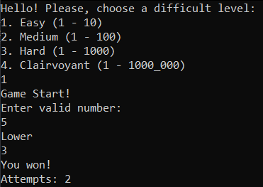
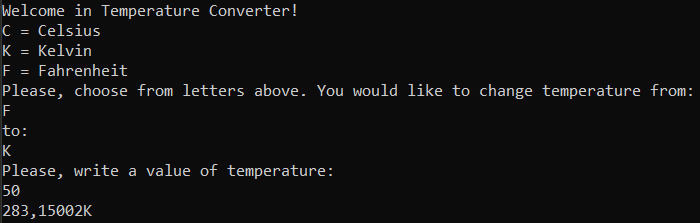
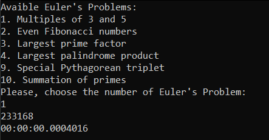
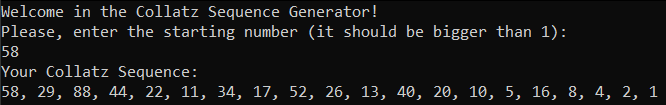

# ProgrammingChallenges
Programming challenges in C#

## Table of content
* [00 Name generator](#00)
* [01 Higher/lower](#01)
* [02 Temperature Converter](#02)
* [07 Projet Euler](#07)
* [15 Collatz Conjecture](#15)

## Solutions
* <a name="00">00</a> [Name generator](ProgrammingChallenges/NameGenerator) 

* <a name ="01">01</a> [Higher/lower](ProgramingChallenges/HigherLower) 

* <a name="02">02</a> [Temperature Converter](ProgrammingChallenges/TemperatureConverter) 

* <a name="07">07</a> [Project Euler](ProgrammingChallenges/Project%20Euler) 

* <a name="15">15</a> [Collatz Conjecture](ProgrammingChallenges/CollatzConjecture) 

